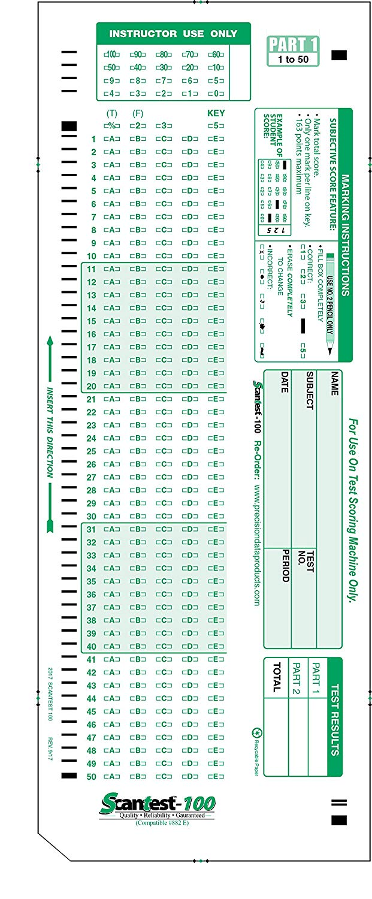

# Assignment 2

In the assignment 2, you will be building a scantron OCR application in Python Flask. The application handles:

* Scantron submission
* Format validation
* Score calculation against answer keys
* Score reporting

All the above features will be handled via a set of REST APIs. The application will persist data into a local SQLite DB.

# APIs

## Create a test

_Request_

> POST http://localhost:5000/api/tests

```json
{
    "subject": "Math",
    "answer_keys": {
        "1": "A",
        "2": "B",
        "3": "C",
        "..": "..",
        "49": "D",
        "50": "E"
    }
}
```

_Response_

```json
201 Created

{
    "test_id": 1,
    "subject": "Math",
    "answer_keys": {
        "1": "A",
        "2": "B",
        "3": "C",
        "..": "..",
        "49": "D",
        "50": "E"
    },
    "submissions": [] 
}
```


## Upload a scantron

_Request_

> POST http://localhost:5000/api/tests/1/scantrons


```
# HTTP Request Body
BINARY_SCANTRON_PDF_FILE_DATA
```

_Response_

```json
201 Created

{
    "scantron_id": 1,
    "scantron_url": "http://localhost:5000/files/1.pdf",
    "name": "Foo Bar",
    "subject": "Math",
    "score": 40,
    "result": {
        "1": {
            "actual": "A",
            "expected": "B"
        },
        "..": {
            "actual": "..",
            "expected": ".."
        },
        "50": {
            "actual": "E",
            "expected": "E"
        }
    }
}
```

## Check all scantron submissions

_Request_

> GET http://localhost:5000/api/tests/1


_Response_

```json
{
    "test_id": 1,
    "subject": "Math",
    "answer_keys": {
        "1": "A",
        "2": "B",
        "3": "C",
        "..": "..",
        "49": "D",
        "50": "E"
    },
    "submissions": [
        {
            "scantron_id": 1,
            "scantron_url": "http://localhost:5000/files/1.pdf",
            "name": "Foo Bar",
            "subject": "Math",
            "score": 40,
            "result": {
                "1": {
                    "actual": "A",
                    "expected": "B"
                },
                "..": {
                    "actual": "..",
                    "expected": ".."
                },
                "50": {
                    "actual": "E",
                    "expected": "E"
                }
            }
        }
    ] 
}
```





